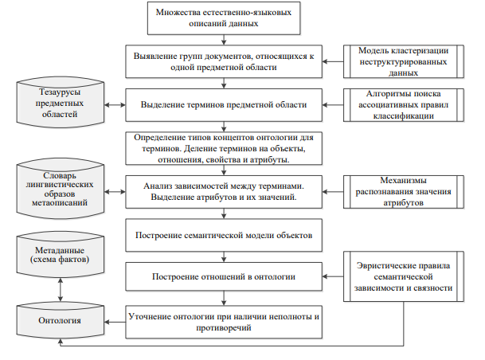
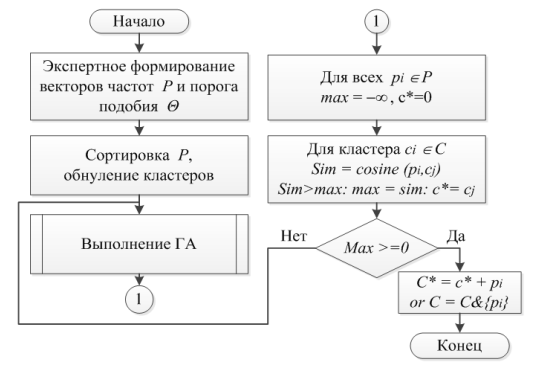

\newenvironment{header}{
    \noindent
    \fontsize{10}{12}\selectfont 
    \raggedleft 
    \vspace{-0.3cm}
    Раздел IV. Анализ данных и управление знаниями
    \setlength{\parindent}{0em}
    \rule{\textwidth}{0.5pt}
}{\vspace{0.3cm}}

\newenvironment{news}{
    \noindent
    \fontsize{10}{12}\selectfont 
    \vspace{-0.2cm}
    Известия ЮФУ. Технические науки \hfill Izvestiya SFedU. Engineering Sciences
    \vspace{-12pt}
    \rule{\textwidth}{0.5pt}
}{\vspace{0.3cm}}

\begin{news}
\end{news}

\vspace{1cm}

\begin{center}
\vspace{1cm}
\textbf{\Large{Раздел IV. Анализ данных и управление знаниями}}
\vspace{0.5cm}
\end{center}

УДК 004.822 \hfill DOI 10.23683/2311- 3103 - 2018 - 4 - 154 - 166

\begin{center}
\textbf{В.В. Бова, С.Н. Щеглов, Д.В. Лещанов}
\end{center}

\begin{center}
\textbf{МОДИФИЦИРОВАННЫЙ АЛГОРИТМ EM - КЛАСТЕРИЗАЦИИ ДЛЯ
ЗАДАЧ ИНТЕГРИРОВАННОЙ ОБРАБОТКИ БОЛЬШИХ ДАННЫХ \*}
\end{center}

\setlength{\parindent}{2em}
\fontsize{9}{1} \textit{ 
Приводится возможное решение проблем структуризации данных большого объема,
а также их интегрированного хранения в структурах, обеспечивающих целостность, 
непротиворечивость их представления, высокую скорость и гибкость процессов обработки
неструктурированной информации. Для решения указанных проблем предложен метод
построения многоуровневой онтологической структуры, обеспечивающей решение взаимо- 
связанных задач выявления, структуризации и обработки больших массивов данных, 
преимущественно естественно - языковых форм представления. Разработанная на основе 
методов семантического анализа и онтологического моделирования многоуровневая модель,
пригодна для интерпретации и эффективной интегрированной обработки 
неструктурирован- ных данных, полученных из распределенных источников информации. Многоуровневое
представление модели структуризации данных большого объема определяет способы и
механизмы унифицированного метаописания элементов данных на логическом уровне, поиска 
закономернос- тей и классификации признакового пространства на семантическом
уровне и лингвистический уровень реализации процедур выявления, консолидации и 
обогащения данных. В качестве возможного решения данной задачи предлагается метод и 
алгоритм кластерного анализа, который позволяет сократить размерность исходного набора
данных и выявить семантические ареалы терминологического покрытия. Модификация
данного метода заключается в применении масштабируемого и вычислительно 
эффективного генетического алгоритма поиска и генерации весовых коэффициентов, которые 
соответствуют разным мерам подобия множества наблюдаемых признаков, использующихся
при формировании модели кластеризации данных. Полученные данные в серии вычислительных
экспериментов подтвердили теоретическую значимость и перспективность применения метода
кластеризации с ГА оценки семантической близости элементов данных,
представленных в онтологии. 
}
\par
\fontsize{9}{1} \textit{ Семантическая близость; онтология; семантическая сеть; нестуктурированные
данные; большие данные; семантический анализ; семантическая метамодель; генетический алгоритм; кластеризация.
}

\fontsize{10}{1} 
\begin{center}
\textbf{V.V. Bova, S.N. Scheglov, D.V. Leshchanov}
\end{center}

\begin{center}
\textbf{MODIFIED EM-CLUSTERING ALGORITHM FOR INTEGRATED BIG DATAPROCESSING TASKS}
\end{center}

\setlength{\parindent}{2em}
\fontsize{9}{1} \textit{ 
The paper presents a possible solution to the problems of structuring large-scale data, as 
well as their integrated storage in structures that ensure the integrity, consistency of their 
presentation, high speed and flexibility of processing of non-structured information. To solve these 
problems, we propose a method for constructing a multilevel ontological structure that provides 
a solution to the interrelated tasks of identifying, structuring, and processing large data sets, 
predominantly natural language forms of representation. Developed on the basis of 
methods of semantic analysis and ontological modeling,
}

\vspace{-0.2cm}
\rule{0.3\linewidth}{0.4pt}
\noindent
\vspace{0.1cm}
\fontsize{9}{1}
\* Работа выполнена при финансовой поддержке РФФИ (проекты: №18-07-00055, 
№17-07-00446). \newpage

\begin{header}
\end{header}

\setlength{\parindent}{2em}
\fontsize{9}{1} \textit{ 
\noindent a multilevel model is suitable for the interpretation and efficient integrated processing 
of unstructured data obtained from distributed sources of information. The multilevel 
representation of the large-scale data structuring model determines the methods
and mechanisms of the unified meta-description of the data elements at the logical level, the
search for patterns and the classification of the characteristic space at the semantic level, and the
linguistic level of implementation of the procedures for identifying, consolidating and enriching
data. As a possible solution to this problem, we propose a method and algorithm for cluster 
analysis that reduces the dimension of the initial data set and reveals the semantic areas of 
terminological coverage. Modification of this method consists in applying a scalable and computationally
effective genetic algorithm for searching and generating weight coefficients that correspond to
different measures of the similarity of the set of observed features used in the formation of the data
clustering model. The data obtained in a series of computational experiments confirmed the 
theoretical significance and prospects of applying the clustering method with GA to assess the 
semantic proximity of data elements presented in ontology. \newline
\indent Semantic similarity; ontology; semantic network; unstructured data; Bigdata; semantic
analysis; semantic meta-model; genetic algorithms; clustering
}

\fontsize{10}{1} \textbf{Введение.} Современный этап развития направлений исследований в области
обработки больших данных со сложной структурой и цифровых технологий определил переход к семантическим технологиям, что потребовало обязательного учёта
проектирования формальных онтологий предметных областей современных многоцелевых информационных систем (МИС), представленных в виде семантических
сетей. Актуальность проведения исследования вызвана необходимостью развития
методов анализа сложной распределенной информации для задач разработки моделей структуризации данных больших объемов на основе интеграции методов онто-
логического моделирования и семантического анализа. В работе приводится возможное решение проблемы структуризации данных большого объема, а также их
интегрированного хранения в структурах, обеспечивающих целостность, непротиворечивость их представления, высокую скорость и гибкость процессов обработки
неструктурированной информации. Такие структуры характеризуются свойствами
частичной наблюдаемости, динамики, непрерывности, стохастичности. Для решения
указанных проблем предлагается метод формирования многоуровневой онтологической структуры с интерпретацией метаданных, для задач выявления и консолидации
элементов данных из различных предметных областей (ПрО). Разработанные на его
основе модель и алгоритм кластеризации позволит решить задачу обеспечения
структурной и семантической интероперабельности больших данных, представленных в различных предметных областях МИС.В качестве возможного решения 
данной задачи предлагается метод и алгоритм кластерного анализа, который позволяет
сократить размерность исходного набора данных и выявить семантические ареалы
терминологического покрытия. Модификация данного метода заключается в применении масштабируемого и вычислительно эффективного генетического алгоритма
поиска и генерации весовых коэффициентов, которые соответствуют разным мерам
подобия множества наблюдаемых признаков, использующихся при формировании
модели кластеризации данных.

\fontsize{10}{1} \textbf{Методологический анализ проблемы исследования.} Задача кластеризации
больших массивов данных встречается во многих прикладных областях, связанных с разработкой средств 
организации и структурирования гипертекстового пространства (концепция Semantic Web, разработка 
и администрирование веб-сайтов, веб-аналитика и др). На сегодняшний день разработано довольно много методов
иалгоритмов кластеризации, однако далеко не все из предложенных способов могут работать с потоками
больших объемов [@kureichik2016; @kuliyev2017; @kuliyev2017a; @kuliyev2017b; @bova2017a; @bova2018; @kureychik2017; @kureichik2017a; @gladkov2017; @hoang2013], поступающей на обработку в online режиме @bova2017. Для решения этих задач может быть применен математический
аппарат computational intelligence и, прежде всего, искусственные нейронные сети и soft computing [@bova2017a; @bova2018; @kureychik2017; @kopaygorodskiy2014]
.

\newpage

\begin{news}
\end{news}

Исследования и анализ современных подходов в области семантического
анализа и обработки неструктурированных данных показал, что наибольшее распространение получили следующие методы кластеризации: алгоритмы на основе
нейронных сетей, k-means, principal component analysis (PCA), EM-алгоритм [@kuliyev2017; @kureychik2017; @kureichik2017a; @kharchenko2015; @loukachevitch2018].
Метод «k-средних» является количественным, т.е. непосредственно перед его
использованием в той или иной системе необходимо все качественные характеристики, если таковые необходимо обработать, стоит привести к количественным,
иначе обработка таким способом будет невозможна @kravchenko2016. Одним из важных недостатков 
такого распространенного алгоритма является его неустойчивость к так
называемым «выбросам». Здесь имеется ввидуситуация, когда в данных присутствует множество «шумов», что неизбежно приводит к ситуации, когда центры 
кластеров начинают сильно сдвигаться. Для решения этой проблемы используют 
медианы. Такая небольшая модификация алгоритма делает его менее чувствительным 
к «шумам» и «выбросам», поскольку медиана меньше подвержена их влиянию. 
В литературе такую модификацию алгоритма «k-средних» называют
PartitioningAround Method (PAM) [@makarov2014; @pfahringer] .

Другой подход алгоритмов кластеризации потоков данных основывается на
основе анализа плотности обрабатываемых данных. Такие алгоритмы умеют различать кластеры исходя из формы, которая зависит от плотности обрабатываемых
данных. Таким образом, если пара точек находится достаточно близко друг к другу, а область вокруг них плотная, то эти точки объединяются в кластер. 
Алгоритмы DBSCAN @loginov2018, OPTICS @sheglov2017 и DENCLUE @kravchenko2017 являются примерами алгоритмов
кластеризации на основе плотности. С недавнего времени алгоритмы такого типа
стали применяться для анализа потоков данных @sheglov2017.
Так же примерами алгоритмов кластеризации такого типа могут служить алгоритмы 
GMDBSCAN [@loginov2018; @sheglov2017; @kravchenko2017; @esfandani2010; @cassisi2013] и ISDBSCAN [@loginov2018; @sheglov2017; @kravchenko2017; @esfandani2010; @cassisi2013]. Эти алгоритмы являются алгоритмами,
 которым требуется дважды проходить по обрабатываемым данным.

За первый проход извлекается вся необходимая для анализа информация, а затем
на ее основе происходит группировка данных в кластеры. Оба алгоритма не подходят для кластеризации потока данных, так как данные поступают непрерывно
(потоком), а значит необходим алгоритм, который проводит обработку и формирование кластеров за одно сканирование поступающей информации.

DBSCAN-DLP это много-плотностный DBSCAN на основе разделения по
уровням плотности @loginov2018. Алгоритм определяет параметры каждого кластера с целью автоматического обнаружения кластеров с различающейся плотностью, 
используя разделение по уровням плотности. В этом способе сначала набор данных
делится по разным уровням плотности на основе статистической информации об
ее изменениях. Затем, для каждого уровня вычисляется параметр ε. На последнем
этапе работы алгоритма, для получения итоговых кластеров DBSCAN использует
для кластеризации на каждом уровне плотности соответствующее значение параметра ε. DBSCANDLP является алгоритмом кластеризации в два этапа обработки
данных, который к тому же, имеет высокое вычислительное время, что делает его
не подходящим для обработки потоков данных.
Каждый из методов имеет свои достоинства, но обладает и рядом ограничений: исходные данные должны иметь случайную природу и подчиняться 
нормальному закону распределения; возможно «застревание» процесса оптимизации в локальных экстремумах; вычислительная сложность; массив данных, подлежащих
кластеризации, задан заранее и не изменяется в процессе обработки. Данные методы вычислительного интеллекта должны быть существенно модифицированы для
обработки больших объемов информации. В качестве возможного решения данной
задачи предлагается метод и алгоритм кластеризации потока данных, взвешенных
по времени поступления. Алгоритм кластерного анализа позволяет сократить размерность исходного набора данных и выявить семантические ареалы 
терминологического покрытия на основе ГА оценки семантической близости.

\newpage

\begin{header}
\end{header}

\textbf{1. Постановка задачи построения многоуровневой структуры онтологии.}

Для задачи структурирования данных в рамках одной системы понятийной 
концептуализации предлагается модель онтологии, ориентированная на обработку
естественно-языковых описаний элементов данных, необходимых для создания и
наполнения базы знаний онтологического типа.
В общем виде постановка задачи исследования может быть сформулирована
следующим образом. Для заданной пятерки <O,F,D,Term,S>, где O – онтология
ПрО, расширенная лингвистическим уровнем, F– множество моделей метаданных
(схем фактов), D – текстовый фрагмент метаописания (далее документ), Term –
терминологическое покрытие D, C – сегментное покрытие (кластеры) D, найти все
семантические структуры, соответствующие онтологии O, покрывающие область
D, которые можно получить в процессе применения правил из Fк Term с учетом C.

Выделение структуры предметной области (онтологии) – это основная задача
по приведению неструктурированных данных к структурированному виду. Весь
процесс построения онтологии разбит на несколько независимых этапов решения
определенной задачи, результаты которой служат исходными данными для задачи
следующего более сложного уровня. Выделим следующую последовательность
действий: извлечение из документов на естественном языке терминов-кандидатов
\rightarrow \ разбиение терминов на группы (кластеризация) \rightarrow \ присвоение обобщающего
понятия-концепта каждой группе \rightarrow \ определение отношений между концептами
\rightarrow \ формирование правил вывода (расширения концептов словаря метаописаний).
Проблемы семантического моделирования структуры данных обычно связаны именно 
с неструктурированными данными, представленными естественноязыковыми описаниями.
На @fig:pic1 представлена логическая схема построения
формальной онтологии на основе семантического анализа понятий и отношений во
множестве естественно-языковых описаний данных.

{#fig:pic1}

\newpage

\begin{news}
\end{news}

\indent Общим для всех формализаций является выделение множества объектов
(концептов, понятий), алфавита отношений, правил установления отношений и
аксиом, задающих правила вывода на множестве отношений. \newline
\indent Для построения модели онтологии как расширяемого тезауруса применяются: 
алгоритмы формирования и пополнения лингвистических шаблонов (словарей), 
механизмы распознавания значений атрибутов, эвристические правила, позволяющие
выявлять зависимость между концептами в онтологии и отношения
между объектами схемы фактов. \newline
\indent Тогда абстрактную модель онтологии O можно формально представить следующим образом:

\begin{center}
\begin{math}
O= \textlangle W\{X, E \textsubscript{x}, N \textsubscript{o}\}, V\{I, S, D \textsubscript{s}\}, R,A\textrangle ,
\end{math}
\end{center}

\noindent где W – тезаурус ПрО, для которого представлено X – множество концептов онтологии – обобщающий класс понятий (терминов),
обладающих одинаковыми свойствами и отношениями; Ex – множество экземпляров понятий и No – множество
имен понятий, для которых задано отображение Ex: X \rightarrow \begin{math} 2^{E_{x}} \end{math} ; \newline
\indent V – словарь лингвистических образов (шаблонов, паттернов) метаописаний,
включающий I – множество информационных входов (языковых выражений, значения которых представлены в W); Sij ={xi, ij} – множество 
отношений семантической связности между I и X;Ds– отображение множества схем фактов заданных
документовна информационные входы и понятия тезауруса ПрОDs: \begin{math} \text{ПрОD}_s \!: (F, D) \rightarrow (I, X); \end{math} \newline
\indent R – совокупность отношений \begin{math} \mathit{R} = \{ \mathit{R}_{1}, \mathit{R}_{2}, \ldots, \mathit{R}_{n} \} \end{math}
междупонятиями W и V, определяемых эвристическими алгоритмами поиска правил анализа связности; \newline
\indent A – аксиомы, основанные на свойствах транзитивности и наследования. \newline
\indent \textbf{2. Модифицированный метод EM - кластеризации данных.} Рассмотрим модифицированный метод EM-кластеризации, основанный на применении GA
нахождения весовых коэффициентов для оценки семантической близости данных,
последовательно поступающих на обработку в on-line режиме. Одним из широко
известных и используемых алгоритмов кластеризации, который наиболее эффективно работает с большими объемами поступающих данных, является 
Expectation-Maximization (ЕМ) алгоритм @mumford2009. Область применения данного алгоритма достаточна широка, он используется не только для кластеризации данных, 
но и в дискриминантном анализе, а также для восстановления пропусков в данных. В основе
алгоритма лежит методика интерактивного вычисления оценок максимального
правдоподобия. В нем вместо центров кластеров предполагается наличие функции
плотности вероятности распределения для каждого кластера. Основной алгоритм
разделен на два шага.

На E-шаге вычислим \begin{math} P(t \! \mid \! w, d)^{(r)} \end{math}. На этапе предварительной обработки и 
анализа будем рассматривать документ как «набор понятий» с численными характеристиками
встречаемости терминов. Вероятность того, что термин w, принадлежащий формируемому тезаурусу W, встречается в метаописании d (множества D
обрабатываемых документов) и принадлежит определенной ПрОt:

\begin{equation}
P(w \!\mid d) = \sum_{t \in T} P(w \!\mid t) P(t \mid d)
\end{equation}

где t – элемент множества T предметных областей.\newline
\indent Параметры предварительного семантического анализа \begin{math} P(w \!\mid \! t) и P(d \!\mid \! d) \end{math} 
определим следующим образом. Пусть r – число итераций.

\begin{equation}
P(t \!\mid\! w, d)^r = \frac{P(w \!\mid\! t)^{(r-1)} P(t \!\mid\! d)^{(r-1)}}{\sum_{t' \in T} P(w \!\mid\! t')^{(r-1)} P(t' \!\mid\! d)^{(r-1)}}
\end{equation}

\newpage

\begin{header}
\end{header}

На M-шаге оценим параметры:

\vspace{-0.5cm}
\begin{equation}
\begin{aligned}
P(w \mid t) &= \frac{\sum_{d \in D} N(w, d) P(t \mid w, d)^r}{\sum_{w' \in W} \sum_{d \in D} N(w', d) P(t \mid w', d)^r} \\
{\raggedright \text{и}} \\
P(t \mid d)^r &= \frac{\sum_{w \in W} N(w, d) P(t \mid w, d)}{\sum_{t' \in T} \sum_{w \in W} N(w, d) P(t' \mid w, d)^{r'}}
\end{aligned}
\end{equation}
\vspace{-0.5cm}

\noindent где N(w,d) – число вхождения элемента тезауруса w в рассматриваемый документ
d. Процесс обучения повторяется до сходимости параметров. Однако параметры
часто попадают в область локального оптимума. Для повышения эффективности и
управления скоростью обучения введем параметр 0<β≤1. 

Тогда на M-шаге выражение имеет вид:

\vspace{-0.5cm}
\begin{equation}
P(t|w,d)^r = \frac{(P(w|t)^{(r-1)}P(t|d)^{(r-1)})\beta }{\sum_{t'\in T}(P(w|t')^{(r-1)}P(t'|d)^{(r-1)})\beta }
\end{equation}
\vspace{-0.5cm}

\indent Далее определим W(w,t) и D(d,t)суммарные вероятности как:

\vspace{-0.5cm}
\begin{equation}
\begin{aligned}
W(w,t)^r &= \sum_{d \in D} N(w,d)P(t|w,d)^r \\
{\raggedright \text{и}} \\
D(d,t)^r &= \sum_{w \in W} N(w,d)P(t|w, d)^r.
\end{aligned}
\end{equation}
\vspace{-0.5cm}

\indent Из (4) получим:

\vspace{-0.5cm}
\begin{equation}
W(w,t)^r = \sum_{d \in D} \frac{N(w,d)(P(w \mid t)^{(r-1)}P(t \mid d)^{(r-1)})^\beta}{\sum_{t' \in T}(P(w \mid t')^{(r-1)}P(t' \mid d)^{(r-1)})^\beta}
\end{equation}

\begin{equation}
D(d, t) = \sum_{w \in W} \frac{N(w,d)(P(w \mid t)^{(r-1)}P(t \mid d)^{(r-1)})^\beta}{\sum_{t' \in T}(P(w \mid t')^{(r-1)}P(t' \mid d)^{(r-1)})^\beta}
\end{equation}
\vspace{-0.5cm}

\indent Для формирования отношений семантической сети тезауруса и вычисления
семантической близости \textit{sim (a, b)} между терминами a и b введем \begin{math} \upomega \end{math} \ – весовую
функцию, определенную над множеством семантических отношений \textit{R(a; b)}, выражающую силу
семантической связи между \textit{a} и \textit{b}. Отношение R(a; b) представляется набором лексических паттернов. Обозначим частоту встречаемости для пары
\textit{(a; b)} как \textit{f(r; a; b)}.

\vspace{-0.5cm}
\begin{equation}
w(R(a, b)) = \sum_{r_i\in R(a, b)} W_i \times f(r_i, a, b),
\end{equation}
\vspace{-0.5cm}

где wi – вес, связанный с ri и определяемый с использованием обучающей выборки.
Модифицированный алгоритм обрабатывает потоки данных, взвешенные по
времени поступления. Весовой коэффициент введен для того, чтобы была возможность учитывать актуальность поступающих в кластер данных.
\indent Для преодоления указанных ограничений и определения семантически связанных терминов разработан модифицированный алгоритм кластеризации (@fig:pic2), 
в котором приняты следующие обозначения: P – вектор частот пар (a, b)соответственно
принадлежащих множествам Dи Term, f(ai; bi; p), в лексических паттернах p ; Θ – порог
подобия (задается экспертом); SORT – функция сортировки по общей встречаемости в парах (a, b). Косинусный коэффициент применяется для вычисления подобия
между p i и центроидом кластера c j.
\indent Для повышения эффективности расчета меры семантической близости и
определения семантически связанных терминов предлагается использовать генетический алгоритм (ГА) (@fig:pic3) @gaziev2017. Для нахождения оптимальных значений
коэффициентов по методу максимизации оценки близости в ГА определена целевая функция:

\vspace{-0.5cm}
\begin{equation}
F = \max \left(w \left( R \left(a, b \right)\right)\right)
\end{equation}
\vspace{-0.5cm}

\newpage

\begin{news}
\end{news}

{#fig:pic2}

Рассмотрим работу модифицированного генетического алгоритма, который
используется в представленном методе EM-кластеризации. Достоинства данного
подхода заключаются в ограничении области поиска решений, удовлетворяющих
запросам лица принимающего решения, сокращения времени обработки исходных
данных, возможности интерактивной настройки параметров работы алгоритма от
сложности поставленной задачи. Приведем основные этапы работы ГА расчета
меры семантической близости и определения связанных терминов.
\indent Создание начальной популяции – один из важнейших этапов эволюционного
моделирования. В начальной популяции должны быть представлены все возможности
генетического материала. В данном подходе предлагается использовать следующие
принципы формирования начальной популяции: «одеяла», «дробовика»,
«фокусировки» и их комбинаций. Выбор того или иного принципа зависит от 
размерности поставленной задачи, предполагаемого времени получения приемлемого
решения, оценки неструктурированности входных данных. В приведенных ниже
экспериментальных исследованиях в основном использовался принцип дробовика
для того, чтобы разнообразить генофод на начальных стадиях работы ГА.
\indent Первый этап предполагает различные варианты формирования начальных
параметров работы алгоритма. Возможна автоматическая генерация параметров
элементов модели близости. Наиболее приемлемым является ввод значения весовых
коэффициентов wi и вероятностей для операторов кроссинговера и мутации
на основе экспертных данных, либо предпочтений лица принимающего решение.
\indent Формирование начальной популяции происходит на основе имеющихся 
обучающих данных из множества C = {ci}. Для каждого элемента выявляются 
семантические отношения ri. Вектор, который описывает термины a и b в логическом
представлении кластера ci, представляет элемент хромосомы (ген). Оценивание
текущей популяции происходит на основе вычисления значения целевой функции
по формуле (9). Исходя из полученных данных, происходит выполнение оператора
селекции. В данном алгоритме применяется элитная селекция–выбираются лучшие решения.

\newpage

\begin{header}
\end{header}

{#fig:pic3}

Для каждой пары, отобранных в результате селекции родительских хромосом,
применяются операторы кроссинговера и мутации с предварительно заданной
вероятностью. Генерирование нового набора особей для каждой пары отобранных
родительских хромосом производится с использованием операторов кроссинговера
и мутации с предварительно заданной вероятностью. Скрещивание хромосом
выполняется случайно с вероятностью Pc. Точка скрещивания определяется случайным образом в заданном интервале.
\indent Исходя из результатов скрещивания, начинается процесс работы оператора
мутации. Данный оператор производит изменения значения гена в хромосоме потомка.
Изменение происходит на основе случайного выбора параметра из интервала [0,1] с вероятностью Pm.
Отбор наиболее перспективных решений производится при помощи оператора рекомбинации.
\indent Завершение работы алгоритма осуществляется проверкой критерия останова.
Если данный критерий не достигнут, то процесс переходит на следующую итерацию.
Временная сложность разработанного алгоритма ориентировочно составляет О(n2).

\textbf{3 Экспериментальные исследования.} С целью анализа эффективности работы предложенных методов был проведен ряд вычислительных экспериментов.

\newpage

\begin{news}
\end{news}

\noindent В качестве тестовых данных используется набор данных (http://people.csail.mit.edu/
jrennie/20Newsgroups), который предназначен для тестирования метода кластеризации. \newline
\indent При помощи этого набора были выполнены эксперименты для проверки точности
предлагаемого метода кластеризации и размера межкластерной корреляционной матрицы 
совместной встречаемости. \noindent Зависимость точности классификатора
от используемого алгоритма и значения расстояния z представлена на @fig:pic4.
В качестве оценки близости векторов используется косинусная мера подобия. 
Горизонтальная ось представляет собой значения коэффициента z, а вертикальная ось
- значения точности классификации двумя алгоритмами (EM и ГА). Считается,
что термин ti встречается вместе с термином tj, если расстояние между ними в документе не превышает предела \textit{z: |i – j|≤z}. \newline
\indent Три серии данных соответствуют значениям точности, полученным при использовании
методов кластеризации разных терминов: All – используются все
терминов; \textit{Noun\&Verb} – используются только существительные и глаголы; \textit{Noun} –
используются только существительные.

\vspace{-0.3cm}
{#fig:pic4}

\indent Графики зависимости размера межкластерной корреляционной матрицы совместной встречаемости терминов и значения расстояния z представлены на @fig:pic5.

\vspace{-0.3cm}
{#fig:pic5}

\indent Исходя из полученных данных видно, что в случае z=0 (классический 
EM-алгоритм), максимальная точность (75,56 %) получается при сохранении в
коллекции документов только существительных. Однако в остальных случаях z>0 (используется

\newpage

\begin{header}
\end{header}

\noindent оценка семантической близости ГА), наивысшая точность (≈82 %)
получается при использовании всех терминов. \newline
\indent Исходя из полученных данных, видно, что в результате кластеризации на основе ГА оценки семантической 
близости терминов значительно уменьшается размер матрицы совместной встречаемости по сравнению со случаем использования
всех терминов: приблизительно 30 % в случае использования только существительных и глаголов и приблизительно 50 % в случае использования только существительных.

\indent В работе выполнено сравнение предлагаемого метода с известными методами кластеризации PCA и k-mean по критерию точности, полноты поиска и
f-критерия (табл. @tbl:cli1).

\vspace{-0.4cm}
\renewcommand{\arraystretch}{1.2} 
\begin{table}[h]
    \centering
    \caption{\raggedleft \\ 
    \centering \textbf{Результаты оценки и сравнения с методами кластеризации} 
    \vspace{-0.2cm}
    }
    \label{tbl:cli1}
    
    \begin{tabular*}{\textwidth}{|@{\extracolsep{\fill}}>{\centering\arraybackslash}m{5.4cm}|>{\centering\arraybackslash}m{2cm}|>{\centering\arraybackslash}m{2cm}|>{\centering\arraybackslash}m{2cm}|} % Таблица на всю ширину
        \hline
        \vspace{0.3cm} Метод \vspace{0.1cm} & Точность & Полнота поиска & f-критерий \\ % Первая строка
        \hline
        Предложенный метод & 0,81428 & 1,00 & 0,8976 \\ % Вторая строка
        \hline
        K-means & 0,7142 & 0,86 & 0,7803 \\ % Третья строка
        \hline
        PCA & 0,3333 & 1,00 & 0,0073 \\ % Четвертая строка
        \hline
    \end{tabular*}
\end{table}
\vspace{-0.3cm}
\indent Согласно результатам, представлены в табл. 1, эффективность предлагаемого
метода составила 0,814 для критерия точности (высокая). По другим критериям
предлагаемый метод также позволил получить более высокие результаты, что говорит о его эффективности.

\textbf{Заключение.} В работе предложен метод формирования многоуровневой онтологической структуры с интерпретацией метаданных, для задач выявления и
консолидации элементов данных из различных ПрО. Разработанные модель и алгоритм кластеризации позволит решить задачу обеспечения структурной и 
семантической интероперабельности больших данных, представленных в различных
предметных областях МИС. Полученные данные в серии вычислительных экспериментов подтвердили теоретическую значимость и перспективность применения
метода кластеризации с ГА оценки семантической близости элементов данных,
представленных в онтологии.